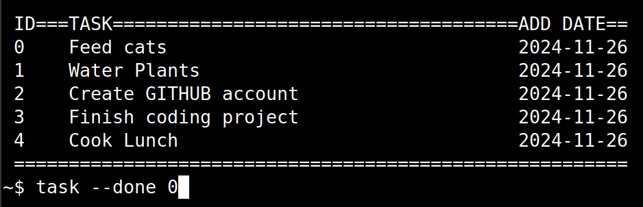

# task by Unpythonic
Task is a small, lightweight task manager/todo list for the linux terminal.



## Why?
Just to see what I could do in 100 lines of python, since my projects tend to suffer from "feature creep" and become more bloated than I originally intended. 

Plus I wanted to test out github before I release my next big bloated (but rather cool) project.

## Install

1. Unzip the 
 and open a terminal in the unzipped folder
2. Make the file executable; type the following and press ENTER:

	```sudo chmod 755 task```
	
3. Copy to /usr/local/bin (or somewhere else in the your path):

	```sudo cp task /usr/local/bin/task```

4. Run task and read the help page:

	```task --help```

## Usage

- To view tasks

	```task```

- Add new tasks

	```task -a Mow lawn```

- Move task 3 to top

	```task -t 3```

- Mark task 1 as done

	```task -d 1```

- Delete all tasks

	```task --delete-all```


## License

MIT


